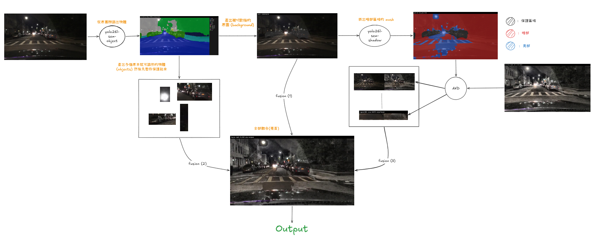

# Night-Iris

自動駕駛完全實現之前，夜間自動駕駛必須先被解決。夜間駕駛影像同時受低光、高強度亮光與極端光照影響，偵測模型在夜間的精準度會明顯下降；夜間資料的取得與標註成本也很高。Night-Iris 在相機與後端偵測模型之間加一層前處理：物件語意模型先標出人、車、號誌等像素並保留原圖，亮暗語意模型再在其餘區域找出暗部，GPU CLAHE 只改那些暗部像素，融合成一張既有偵測模型可以使用的 LDR。

本 repo 是這項前處理的 MVP。clone 之後可以載入已放進 git 的權重，對自己的夜間 LDR 跑完整條管線。第一階段物件模型有時會標錯類別，權重先沿用現在這版，後續再改。




| 子專案                                       | 是什麼                                                                                               |
| ----------------------------------------- | ------------------------------------------------------------------------------------------------- |
| `[night-iris](night-iris/)`               | 前處理本體。讀 LDR，輸出融合後的 LDR，並可抽樣寫階段圖。                                                                  |
| `[gpu-clahe](gpu-clahe/)`                 | `night-iris` 呼叫的 CLAHE kernel（`clahe.py`）。同目錄地下的 `main.py` 是專門用來測試處理 16-bit 圖片的延遲，不產生給 YOLO 的訓練圖。 |
| `[dataset-transform](dataset-transform/)` | 把各種的 Dataset 轉成 YOLO 格式，供 YOLO 進行各種任務的訓練、驗證與測試。                                                   |
| `[yolo-lab](yolo-lab/)`                   | 後端模型 (目前是 YOLO) 的訓練場，在已是 YOLO 格式的各種夜間資料集上做偵測訓練、驗證與 TensorRT 匯出等多項任務，並能用來比較前處理前後的偵測結果。             |


## 環境

- Python **3.11**
- PyTorch **cu126**
- 在 repo 根目錄：

```bash
uv sync --all-packages
```

`uv sync --all-packages` 會一併安裝 `yolo-lab` 的 TensorRT。只跑前處理時仍然用這條指令即可，因為 workspace 的依賴是合在一起鎖的。

## 已放進 git 的權重

推論直接用這三個檔，都在 `night-iris/model/`：


| 檔案                        | 用途                                                                   |
| ------------------------- | -------------------------------------------------------------------- |
| `yolo26l-sem-object.pt`   | 物件遮罩。與 `yolo26l-sem.pt` 是同一份 Ultralytics YOLO-sem 權重，類別為 Cityscapes。 |
| `yolo26l-sem.pt`          | 重訓亮暗模型時的起點，內容與上一列相同。                                                 |
| `yolo26l-sem-shadow-2.pt` | 在 SBU-shadow 上訓練的亮／暗模型，推論時用這份。                                       |


COCO 偵測權重、TensorRT engine、訓練產物 `runs/` 不進 git。偵測微調得到的 `best.pt` 超過 GitHub 單檔 100MB，所以留在本機 `yolo-lab/runs/`。

## 需自行準備的資料

資料集與原圖不進 git。


| 內容                  | 路徑                                              | 說明                                                           |
| ------------------- | ----------------------------------------------- | ------------------------------------------------------------ |
| 前處理輸入               | `night-iris/data/images/`                       | jpg／png。輸出在 `night-iris/result/ldr/`，抽樣階段圖在 `result/debug/`。 |
| SBU-shadow 原始資料     | `night-iris/data/SBU-shadow/`                   | 只有要重訓亮暗模型時才需要。內含 `SBU-Train`、`SBU-Test`。                     |
| 原夜間偵測資料             | `yolo-lab/datasets/bdd10k-night/70-15-15/`      | BDD 夜間 10 類，70/15/15 分割。                                     |
| Night-Iris 處理後的偵測資料 | `yolo-lab/datasets/bdd10k-night-iris/70-15-15/` | 同一分割，影像已跑過 night-iris。                                       |
| COCO 預訓練權重          | `yolo-lab/yolo-coco/yolo26{n,s,m,l,x}.pt`       | 從 Ultralytics 下載後放這裡，偵測實驗才會找到。                               |


## 常用指令

前處理（在 repo 根目錄）：

```bash
uv run --package night-iris --directory night-iris python main.py --config configs/default.toml
```

SBU 轉成 YOLO-sem 後再訓練亮暗模型：

```bash
uv run --package dataset-transform --directory dataset-transform python trans_script/sbu-shadow.py
uv run --package yolo-lab --directory yolo-lab python main.py --config configs/semantic_sbu_shadow_train.toml
```

偵測實驗的設定都在 `yolo-lab/configs/`。原圖與 Night-Iris 圖各有訓練、預訓練驗證、微調驗證，資料路徑都是上面的 `70-15-15`。細節見 `[yolo-lab/README.md](yolo-lab/README.md)`。

16-bit CLAHE 延遲測試（與前處理分開）：

```bash
uv run --package gpu-clahe --directory gpu-clahe python main.py --config configs/default.toml
```


## 文件

- [night-iris 操作說明](night-iris/README.md)
- [gpu-clahe 操作說明](gpu-clahe/README.md)
- [dataset-transform 操作說明](dataset-transform/README.md)
- [yolo-lab 操作說明](yolo-lab/README.md)

